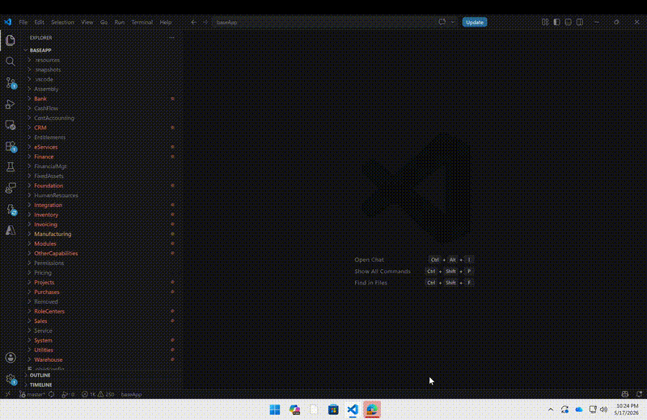
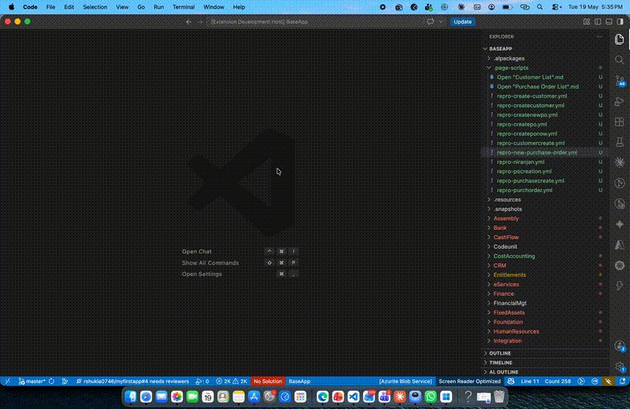
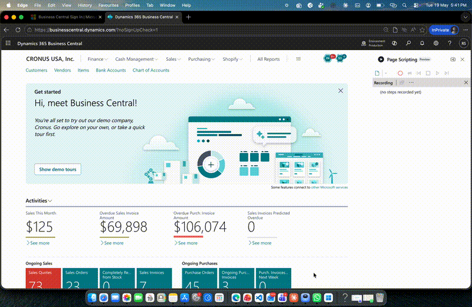
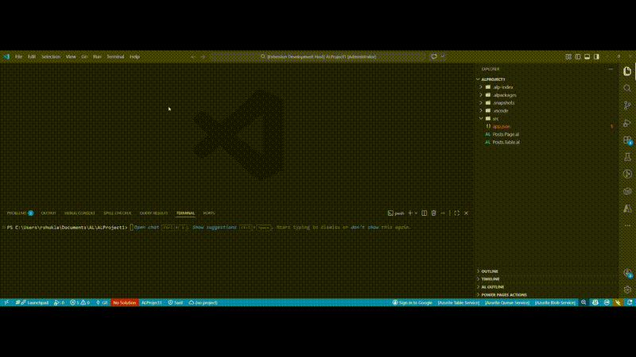
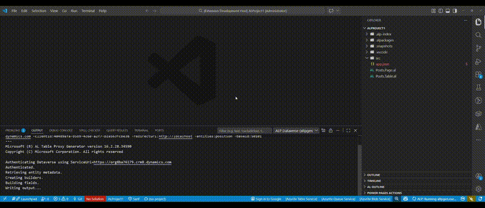
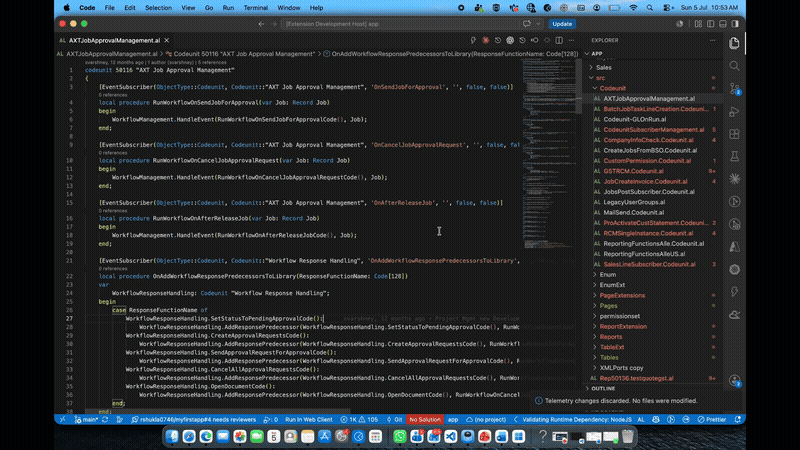
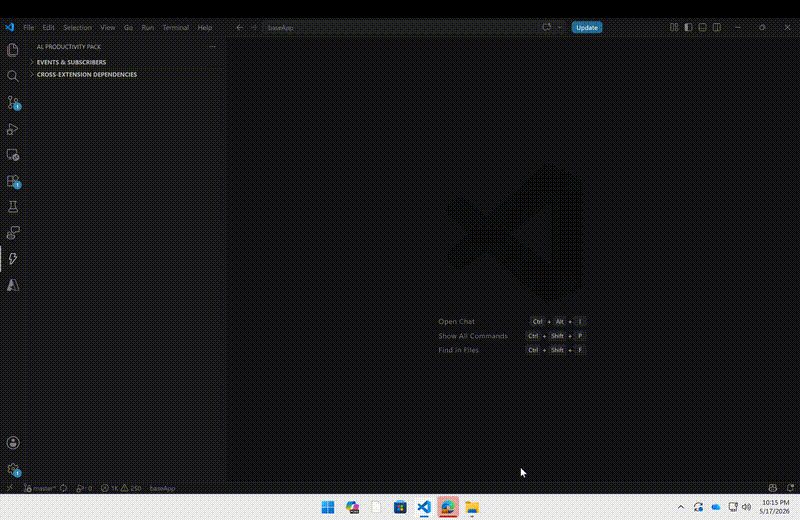

# AL Productivity Pack

<p align="center">
  
</p>

<p align="center">
  <strong>A suite of productivity tools for Business Central AL developers</strong>
</p>

<p align="center">
  <a href="https://marketplace.visualstudio.com/items?itemName=RishabhShukla.al-productivity-pack">
    
  </a>
  <a href="https://marketplace.visualstudio.com/items?itemName=RishabhShukla.al-productivity-pack">
    
  </a>
  <a href="https://github.com/rshuklaOnalletec/al-productivity-pack/blob/main/LICENSE">
    
  </a>
</p>

---

## Why This Extension?

Every Business Central developer knows the pain:

- 🔍 **"Which event do I subscribe to?"** — Digging through base app source to find the right integration event
- 📋 **Copy-paste nightmares** — Getting the subscriber signature wrong because of a typo in object names or parameter lists
- 🔗 **"Who else subscribes to this?"** — No easy way to see all subscribers across your codebase
- 💀 **Silent failures** — Dead subscribers pointing to events that no longer exist after a BC upgrade

**AL Productivity Pack** solves all of this — directly inside VS Code.

---

## Features

### 🔍 Event Subscriber Finder

Search and discover all published events across your workspace — including the Base Application symbols.

**Command:** `ALP: Find Published Events`

- Instantly search by event name, object name, or parameters
- Navigate directly to the event definition
- Supports `IntegrationEvent`, `BusinessEvent`, and `InternalEvent` types



---

### 🗺️ Subscriber Mapper

See all event subscribers in your codebase and what they're listening to.

**Command:** `AL: Find Event Subscribers`

- View all `[EventSubscriber]` procedures mapped to their targets
- Quick-navigate to any subscriber
- Understand cross-extension dependencies at a glance

---

### ⚡ Boilerplate Generator

Generate correct subscriber code with one click — no more typos.

**Command:** `AL: Generate Event Subscriber Boilerplate`

- Select any event → get a ready-to-use subscriber procedure
- Correct `ObjectType`, object name, event name, and full parameter signature
- Inserts as a VS Code snippet with tab stops for customization

**Example output:**
```al
[EventSubscriber(ObjectType::Codeunit, Codeunit::"Sales-Post", 'OnBeforePostSalesDoc', '', false, false)]
local procedure OnBeforePostSalesDoc(var SalesHeader: Record "Sales Header"; CommitIsSuppressed: Boolean)
begin
    // TODO: Implement subscriber logic
end;
```

---

### 🔗 Event Chain Visualization

Understand the full event flow within any object — see all events fired in execution order.

**Command:** `AL: Show Event Chain`

- Pick an object → see all its published events in sequence
- Visual flow diagram in a side panel
- Helps choose the *right* hook point (OnBefore vs OnAfter vs OnRun)

---

### 💀 Dead Subscriber Detection

Find subscribers in your code that point to events which no longer exist.

**Command:** `AL: Detect Dead Subscribers`

- Scans all `[EventSubscriber]` procedures
- Flags any whose target event can't be found in the index
- Prevents runtime errors after BC version upgrades
- Navigate directly to problematic code

---

### 🌳 AL Events Explorer (Tree View)

A dedicated tree view in the Activity Bar showing all events grouped by object.

- Grouped by object type and name
- Click to navigate to event source
- Tooltip with full event details
- Auto-refreshes on file changes

---

### 🔀 Cross-Extension Dependency Explorer

Track how your apps depend on each other across a multi-app workspace.

- See which projects extend your tables, pages, enums, and codeunits
- Track field references and Record variable usage across projects
- Detect cross-project dependencies instantly
- Tree view in the Activity Bar with full drill-down

---

### 📦 App Dependency Graph (Deploy Sequence)

Visualize the deployment order for all your apps.

**Command:** `ALP: Show App Dependency Graph`

- Numbered deploy sequence — exact order to publish
- Clickable items — jump directly to each app's `app.json`
- Parallel deploy detection (apps with no interdependency)
- External dependencies grouped by publisher (Microsoft, Lanham, EOS, etc.)
- Scans workspace + sibling project folders automatically

---

### 📄 File Insights

One-click summary of the current AL file — right from the editor title bar.

**Command:** `ALP: File Insights`

- Objects, events, subscribers, fields, extensions, and cross-references in the file
- Quick navigation to any item
- Editor title button (icon) for instant access

---

### 🎬 Page Script Generator

Convert human-readable repro steps into BC Page Scripting YAML — ready to run in Business Central's test automation.

**Command:** `ALP: Generate Page Script from Repro Steps`

- Write steps in natural DSL: `Open`, `Click`, `Set`, `Confirm`, `Choose`, `Validate`, `Wait`
- Quotes optional on field names — `Set Name = "Value"` works just like `Set "Name" = "Value"`
- Intelligent field resolution from AL page sources (workspace + `.alpackages`)
- QuickPick field selector when mapping is needed — browse all fields on the page
- Handles Confirm/Choose dialogs with correct automationIds
- Subpage/lines input with proper part → page → repeater path
- Output saved to `.page-scripts/` directory

**DSL Example:**
```
Open "Purchase Order List"
Click "New"
Set Buy-from Vendor Name = "10000"
In "PurchLines" Set No. = "1000"
In "PurchLines" Set Quantity = "1"
Click "Release"
Click "Post"
Choose 2
Confirm "Yes"
```



**Running in Business Central:**



---

### ☁️ Dataverse Integration Generator

Generate complete Dataverse integration boilerplate — coupling codeunit, list page, and page extension — from a guided wizard.

**Command:** `ALP: Generate Dataverse Integration Boilerplate`

- Single-screen wizard: pick a Dataverse entity, target BC table, and base object ID
- **Live entity lookup** from your Dataverse environment (OAuth2 Device Code Flow)
- Token caching — authenticate once per session, reuse silently
- Runs `altpgen.exe` under the hood to generate the CDS table definition
- Parses the generated table to extract real field names, IDs, and primary keys
- **Auto-detects** the target page from the BC table's `LookupPageId` / `CardPageId` properties
- Professional **field mapping webview** with:
  - Dropdown-based BC → Dataverse column pairing
  - Smart auto-match (name similarity) pre-populated
  - Per-field direction toggle (↔ Bidirectional, → To DV, ← From DV)
  - Search/filter, stats bar, Clear All / Auto-Match buttons
- Generates:
  - **Coupling Codeunit** — full `Match()`, `UpdateOne()` logic with correct field mappings
  - **List Page** — Dataverse entity list with coupling actions
  - **Page Extension** — Coupled indicator & sync action on the detected card/list page

**Prerequisites:**
- AL Language extension installed (provides `altpgen.exe`)
- Microsoft Entra app registration with **public client flow** enabled
- Dataverse environment URL + Client ID configured in settings

**Wizard & Entity Selection:**



**Field Mapping & Code Generation:**



---

### 🤖 AI Telemetry Agent

Intelligently instruments your AL code with Microsoft-recommended `FeatureTelemetry` calls — powered by Copilot's language model.

**Command:** `ALP: Add Telemetry (AI)`

- **Scope choice** — analyze the active file or scan the entire project
- **Auto-detects feature names** from AL object declarations (no manual input needed)
- **Smart classification** — reads each procedure's code to decide what telemetry is appropriate
- **Specific event names** — generates descriptions like "Item UOM inserted", not generic "Records processed"
- **CustomDimensions** — always includes relevant context (record IDs, key fields, counts)
- **Inline preview** — proposed lines highlighted green in the editor; browse freely before deciding
- **Accept / Discard** — persistent status bar buttons; nothing is saved until you explicitly accept
- Handles `case...of` blocks, nested begin/end, and proper procedure boundary detection
- Follows Microsoft guidelines: `FeatureTelemetry.LogUsage`, `LogError` (only in existing error paths), `LogUptake`



---

### 🖱️ Right-Click Context Menus

- **Peek Subscribers at Cursor** — right-click any event to see all subscribers
- **Peek Cross-References at Cursor** — right-click any AL symbol to find who uses it
- **Generate Subscriber for Event** — right-click an event to scaffold a subscriber

---

## Installation

### From VS Code Marketplace

1. Open VS Code
2. Go to Extensions (`Ctrl+Shift+X` / `Cmd+Shift+X`)
3. Search for **"AL Productivity Pack"**
4. Click **Install**

### From VSIX (Manual)

```bash
code --install-extension al-productivity-pack-0.2.0.vsix
```

---

## Configuration



| Setting | Default | Description |
|---------|---------|-------------|
| `alProductivityPack.searchPaths` | `[]` | Additional paths to scan for AL files |
| `alProductivityPack.includeBaseApp` | `true` | Include Base Application events from `.alpackages` |
| `alProductivityPack.autoRefresh` | `true` | Auto-refresh index when AL files change |
| `alProductivityPack.dataverse.serviceUrl` | `""` | Dataverse environment URL (e.g. `https://org.crm8.dynamics.com`) |
| `alProductivityPack.dataverse.clientId` | `""` | Microsoft Entra app client ID for Dataverse auth |
| `alProductivityPack.dataverse.redirectUri` | `""` | Optional redirect URI (leave empty for default) |
| `alProductivityPack.dataverse.altpgenPath` | `""` | Optional full path to `altpgen.exe` if auto-detection fails |

### Example settings.json

```json
{
  "alProductivityPack.searchPaths": [
    "/path/to/shared/al-symbols"
  ],
  "alProductivityPack.includeBaseApp": true,
  "alProductivityPack.autoRefresh": true
}
```

---

## Commands

| Command | Description |
|---------|-------------|
| `ALP: Find Published Events` | Search all indexed events with quick-pick |
| `ALP: Find Event Subscribers` | Browse all subscribers in workspace |
| `ALP: Generate Event Subscriber Boilerplate` | Pick an event and insert subscriber code |
| `ALP: Show Event Chain` | Visualize event flow for an object |
| `ALP: Detect Dead Subscribers` | Find subscribers with missing targets |
| `ALP: Refresh Event Index` | Manually rebuild the event index |
| `ALP: Peek Subscribers at Cursor` | Show subscribers for event under cursor |
| `ALP: Peek Cross-References at Cursor` | Show cross-project references for symbol |
| `ALP: File Insights` | Summary of current file's AL objects |
| `ALP: Show App Dependency Graph` | Deploy sequence visualization |
| `ALP: Generate Page Script from Repro Steps` | Convert DSL repro steps to BC Page Script YAML |
| `ALP: Generate Dataverse Integration Boilerplate` | Wizard-driven Dataverse coupling code generation |
| `ALP: Clear Dataverse Credential Cache` | Clear cached Dataverse OAuth token |
| `ALP: Add Telemetry (AI)` | AI-powered telemetry instrumentation with preview |

---

## How It Works

1. **Indexing** — On activation (or manual refresh), the extension scans all `.al` files in your workspace and `.alpackages` folder
2. **Parsing** — Regex-based parser extracts `[IntegrationEvent]`, `[BusinessEvent]`, `[InternalEvent]` publishers and `[EventSubscriber]` attributes
3. **Mapping** — Events and subscribers are cross-referenced to build a complete dependency graph
4. **Querying** — Commands provide instant search, navigation, and code generation from the index

---

## Roadmap

- [x] **v0.1** — Event Subscriber Finder, CodeLens, Dependency Explorer, App Dependency Graph
- [x] **v0.2** — Page Script Generator (DSL → BC Page Scripting YAML)
- [x] **v0.3** — Dataverse Integration Generator (wizard, field mapping, code generation)
- [x] **v0.4** — AI Telemetry Agent (project-wide analysis, inline preview, accept/discard)
- [ ] **v0.5** — AL Test Helper tools
- [ ] **v0.6** — Object ID conflict detection across extensions
- [ ] **v1.0** — Stable release with full feature set

See the [CHANGELOG](CHANGELOG.md) for release history.

---

## Contributing

Contributions are welcome! Please see [CONTRIBUTING.md](CONTRIBUTING.md) for guidelines.

- 🐛 [Report a bug](https://github.com/rshuklaOnalletec/al-productivity-pack/issues/new?template=bug_report.md)
- 💡 [Request a feature](https://github.com/rshuklaOnalletec/al-productivity-pack/issues/new?template=feature_request.md)
- 🔧 [Submit a PR](https://github.com/rshuklaOnalletec/al-productivity-pack/pulls)

---

## Requirements

- VS Code 1.85.0 or higher
- Works best alongside the official [AL Language extension](https://marketplace.visualstudio.com/items?itemName=ms-dynamics-smb.al)

---

## License

[MIT](LICENSE) © Rishabh Shukla

---

<p align="center">
  Made with ❤️ for the Business Central community
</p>
